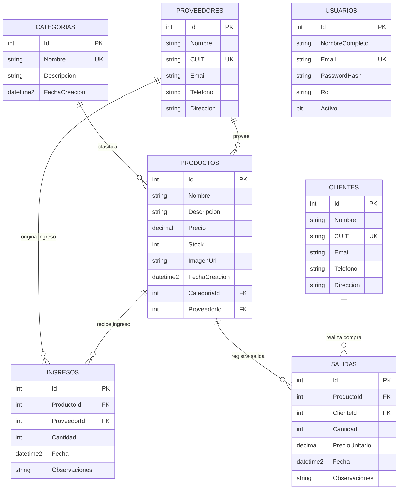

# Modelo de Datos — TPN 5 · API de Inventario

Documentación del esquema relacional de la API REST de gestión de inventario.

## 1. Resumen del modelo

| Aspecto | Detalle |
|---|---|
| **Tecnología** | ASP.NET Core 9 (C#) + Entity Framework Core 9 (Code-First) |
| **Motor de base de datos** | SQL Server (LocalDB) — Base de datos `TPN5_MovilDb` |
| **Tablas** | 7 entidades: `Categorias`, `Proveedores`, `Clientes`, `Usuarios`, `Productos`, `Ingresos`, `Salidas` |
| **Esquema de origen** | Migración única `Inicial` (`Migrations/20260915185027_Inicial.cs`) |
| **Integridad referencial** | Todas las claves foráneas configuradas con `ON DELETE RESTRICT` |

Relaciones principales:

```
Categorias  1 ────── N Productos
Proveedores 1 ────── N Productos
Proveedores 1 ────── N Ingresos
Productos   1 ────── N Ingresos
Productos   1 ────── N Salidas
Clientes    1 ────── N Salidas
```

## 2. Diagrama entidad-relación



**Notas sobre multiplicidad**:
- `Categoria` (1) → `N Productos`: un producto pertenece exactamente a una categoría y las categorías pueden tener muchos productos (FK no nullable).
- `Proveedor` (1) → `N Productos` y (1) → `N Ingresos`: un proveedor puede suministrar muchos productos y originar muchos ingresos.
- `Producto` (1) → `N Ingresos` y (1) → `N Salidas`: un producto acumula el histórico de todas sus entradas y salidas de stock.
- `Cliente` (1) → `N Salidas`: un cliente puede realizar muchas compras (salidas).
- `Usuario` es una entidad **aislada** (autenticación/JWT); no participa en relaciones con el resto del esquema.

## 3. Diccionario de datos

Leyenda tipos: `nvarchar(max)` = texto largo opcional; `datetime2` = fecha/hora (UTC).

### 3.1 `Categorias` — Clasificación de productos

| Columna | Tipo SQL | Nulabilidad | Restricción |
|---|---|---|---|
| `Id` | int | No | PK, identidad (1,1) |
| `Nombre` | nvarchar(100) | No | **Único** (`IX_Categorias_Nombre`) |
| `Descripcion` | nvarchar(max) | Sí | — |
| `FechaCreacion` | datetime2 | No | Default `DateTime.UtcNow` |

### 3.2 `Proveedores` — Entidades que suministran productos

| Columna | Tipo SQL | Nulabilidad | Restricción |
|---|---|---|---|
| `Id` | int | No | PK, identidad (1,1) |
| `Nombre` | nvarchar(150) | No | — |
| `CUIT` | nvarchar(20) | No | **Único** (`IX_Proveedores_CUIT`) |
| `Email` | nvarchar(max) | Sí | — |
| `Telefono` | nvarchar(max) | Sí | — |
| `Direccion` | nvarchar(max) | Sí | — |

### 3.3 `Clientes` — Compradores

| Columna | Tipo SQL | Nulabilidad | Restricción |
|---|---|---|---|
| `Id` | int | No | PK, identidad (1,1) |
| `Nombre` | nvarchar(150) | No | — |
| `CUIT` | nvarchar(20) | No | **Único** (`IX_Clientes_CUIT`) |
| `Email` | nvarchar(max) | Sí | — |
| `Telefono` | nvarchar(max) | Sí | — |
| `Direccion` | nvarchar(max) | Sí | — |

### 3.4 `Usuarios` — Cuentas de acceso al sistema

| Columna | Tipo SQL | Nulabilidad | Restricción |
|---|---|---|---|
| `Id` | int | No | PK, identidad (1,1) |
| `NombreCompleto` | nvarchar(150) | No | — |
| `Email` | nvarchar(150) | No | **Único** (`IX_Usuarios_Email`) |
| `PasswordHash` | nvarchar(500) | No | Hash generado con `PasswordHasher` (ASP.NET Identity) |
| `Rol` | nvarchar(max) | No | `Admin` o `Usuario` (default `Usuario`) |
| `Activo` | bit | No | Default `true` |

### 3.5 `Productos` — Ítems del inventario

| Columna | Tipo SQL | Nulabilidad | Restricción |
|---|---|---|---|
| `Id` | int | No | PK, identidad (1,1) |
| `Nombre` | nvarchar(150) | No | Índice `IX_Productos_Nombre` |
| `Descripcion` | nvarchar(max) | Sí | — |
| `Precio` | decimal(18,2) | No | No negativo (validado en API) |
| `Stock` | int | No | Se actualiza con ingresos/salidas |
| `ImagenUrl` | nvarchar(300) | Sí | Ruta en `wwwroot/uploads/...` |
| `FechaCreacion` | datetime2 | No | Default `DateTime.UtcNow` |
| `CategoriaId` | int | No | **FK** → `Categorias.Id`, `RESTRICT` |
| `ProveedorId` | int | No | **FK** → `Proveedores.Id`, `RESTRICT` |

Índices: `IX_Productos_CategoriaId`, `IX_Productos_ProveedorId`, `IX_Productos_Nombre`.

### 3.6 `Ingresos` — Entradas de stock desde proveedores

| Columna | Tipo SQL | Nulabilidad | Restricción |
|---|---|---|---|
| `Id` | int | No | PK, identidad (1,1) |
| `ProductoId` | int | No | **FK** → `Productos.Id`, `RESTRICT` |
| `ProveedorId` | int | No | **FK** → `Proveedores.Id`, `RESTRICT` |
| `Cantidad` | int | No | > 0 (validado en servicio) |
| `Fecha` | datetime2 | No | Default `DateTime.UtcNow` |
| `Observaciones` | nvarchar(max) | Sí | — |

Índices: `IX_Ingresos_Fecha`, `IX_Ingresos_ProductoId`, `IX_Ingresos_ProveedorId`.

### 3.7 `Salidas` — Ventas / salidas de stock a clientes

| Columna | Tipo SQL | Nulabilidad | Restricción |
|---|---|---|---|
| `Id` | int | No | PK, identidad (1,1) |
| `ProductoId` | int | No | **FK** → `Productos.Id`, `RESTRICT` |
| `ClienteId` | int | No | **FK** → `Clientes.Id`, `RESTRICT` |
| `Cantidad` | int | No | > 0 (validado en servicio) |
| `PrecioUnitario` | decimal(18,2) | No | Copia del `Precio` del producto al vender |
| `Fecha` | datetime2 | No | Default `DateTime.UtcNow` |
| `Observaciones` | nvarchar(max) | Sí | — |

Índices: `IX_Salidas_Fecha`, `IX_Salidas_ProductoId`, `IX_Salidas_ClienteId`.

## 4. Referencias cruzadas (claves foráneas)

| FK | Tabla origen | Columna | Tabla destino | Columna | Delete |
|---|---|---|---|---|---|
| `FK_Productos_Categorias_CategoriaId` | Productos | `CategoriaId` | Categorias | `Id` | Restrict |
| `FK_Productos_Proveedores_ProveedorId` | Productos | `ProveedorId` | Proveedores | `Id` | Restrict |
| `FK_Ingresos_Productos_ProductoId` | Ingresos | `ProductoId` | Productos | `Id` | Restrict |
| `FK_Ingresos_Proveedores_ProveedorId` | Ingresos | `ProveedorId` | Proveedores | `Id` | Restrict |
| `FK_Salidas_Productos_ProductoId` | Salidas | `ProductoId` | Productos | `Id` | Restrict |
| `FK_Salidas_Clientes_ClienteId` | Salidas | `ClienteId` | Clientes | `Id` | Restrict |

## 5. Reglas de negocio e integridad

1. **Movimiento de stock atómico**: al crear un `Ingreso` se incrementa el stock del producto (`Stock = Stock + Cantidad`) dentro de una transacción (`MovimientoService.CrearIngresoAsync`). Al crear una `Salida` se decrementa el stock **solo si hay disponibilidad** (`WHERE Stock >= Cantidad`); en caso contrario se rechaza con "Stock insuficiente".
2. **Precio congelado**: `Salidas.PrecioUnitario` almacena el precio vigente del producto al momento de la venta; el total histórico se calcula como `Cantidad × PrecioUnitario` y no se altera por cambios posteriores de precio.
3. **Eliminación protegida**: al intentar borrar una categoría con productos, un cliente con salidas, un proveedor con productos/ingresos, o un producto con movimientos, la API responde `409 Conflict` (integridad referencial con `DELETE RESTRICT`).
4. **Unicidad**: nombre único en `Categorias`, CUIT único en `Clientes` y `Proveedores`, email único en `Usuarios`.
5. **Validación de cantidades**: `Ingresos.Cantidad` y `Salidas.Cantidad` deben ser mayores que cero; `Precio` no debe ser negativo.
6. **Stock inicial**: al crear un producto el stock se inicia en `0` y solo varía por ingresos/salidas.
7. **Roles de acceso**: las operaciones de escritura/borrado exigen el rol `Admin` (JWT); `Usuarios` solo es gestionable por administradores. El registro de salidas (`POST /api/salidas`) está permitido a cualquier usuario autenticado.